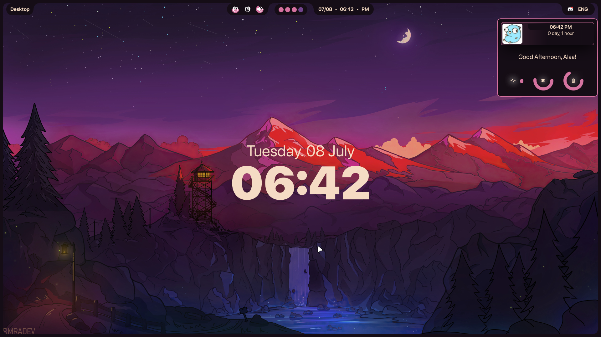

    <h1 style="font-size:50px">🇪🇬HyprLuna Dotfiles🌙</h1>
      

        
        
              
      

      

              
        
        
      

 

<h1>This one with Fabric (Ffpy)</h1>

<h1>✨ ShowCase ✨</h1>

<table>
  <tr>
    <td width="50%" align="center"></td>
  </table>

## 📝 License & Copyright
> This is a rework of HyprLuna dots. It is not forked or based on any other rices. All credits belong to the `HyprLuna Team` assets and applications dependant and used in this rice. belongs to its respective creators/owners. This dot file has been recreated from scratch so close to no inspiration is taken from other dot files.
### also big thanks for Darsh the owner of fabric for his help and support!

Copyright © 2025 <a href="https://github.com/Lunaris-Project">Lunaris Project</a>

This project is licensed under the <a href="https://github.com/Lunaris-Project/HyprLuna/blob/main/LICENSE">MIT License</a>.

<i>🌙 Stars light up the night sky, but the moon illuminates the path 🌙</i>

